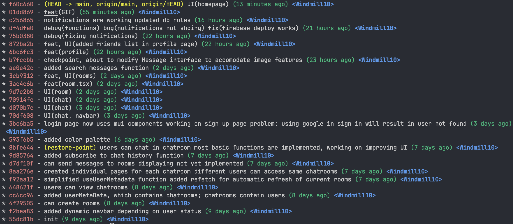

# Website features 

## Overview
This is a simple chatroom for chatting with friends. Built with React + Vite + TypeScript + Firebase. Utilizing Material UI and CSS.anmimate for UI design. The Navbar provides all necessary pages for users to navigate.

## Basic featurea

### Membership Mechanism
- Supports gmail sign-in and sign-out.
- Support google account sign-in and sign-out, and automatically creates a user account in the database.

### Host your Firebase page
- Is hosted with Firebase

### Database read/write

- Used firestore with proper security rules to read and write data.
- Firestore is used to store user data, chatroom data, and messages.
- Firestore storage is used to store user profile images.

### RWD

- The website is responsive and can be used on mobile devices.

### GIT
  
### Chatroom

 - Users can access and create chatrooms in message page
 - All chatrooms are private and invite only
 - Chatrooms support group chat, adding members to chatroom by email, message searching, message history, and message unsending.

 ## Advanced components

 - Is built with React + Vite
 - Supports google sign-in and sign-out
 - Supports chrome notifications
 - CSS animation is used in chatroom, messages "bounce" when new messages are rendered
 - Alert scripts and console logs are used to debug the code throughout the project

 ## Bonus components
 - User profile page where users can edit their profile information (name, description, phone number, address) and avatar
 - Profile picture is uploaded to Firebase storage
 - Users can hover over a message and unsend it
 - Users can search for messages in the chatroom
 - Users can send gifs like any other message

 ## Additional features

 - Used Material UI theme for consistent design
 - Supports adding friends and members to chatroom by email
 - Signing in with Google account will automatically create a user account in the database with corresponding user information
 - Auto scroll to the bottom of the chatroom when new messages are sent